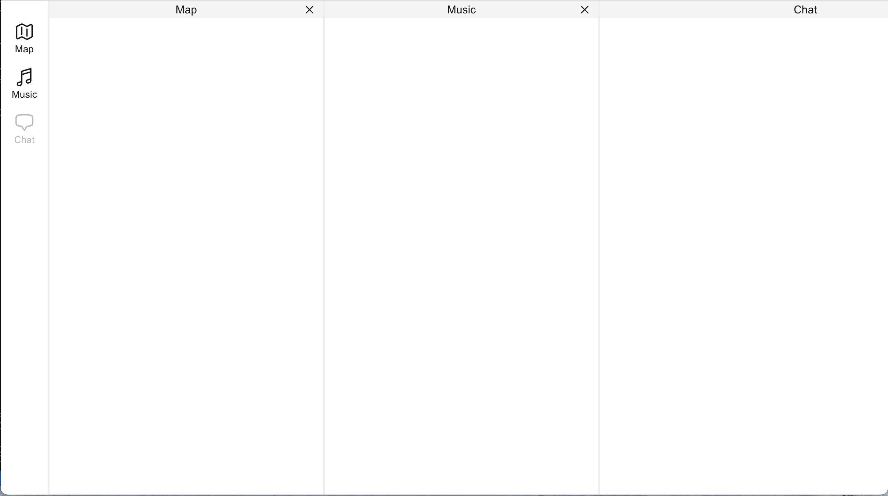

### 效果图

### 开发说明

1.  使用 Nextjs 框架，使用 Tailwindcss
2.  右侧 3 面板在浏览器宽度小的时候可以左右滑动
3.  面板可以点击(x)关闭，关闭后左侧图标变成透明灰色，点击左侧按钮可以打开/关闭
4.  使用 DNDKit 开发，三个面板可以顶部左右拖动实现类似
    https://master--5fc05e08a4a65d0021ae0bf2.chromatic.com/?path=/story/presets-sortable-horizontal--basic-setup
    的效果
5.  拖拽排序后左侧的图标也要排序
6.  图标使用 https://heroicons.com/ 图标为:
    MapIcon, MusicalNoteIcon, ChatBubbleBottomCenterIcon, XMarkIcon
